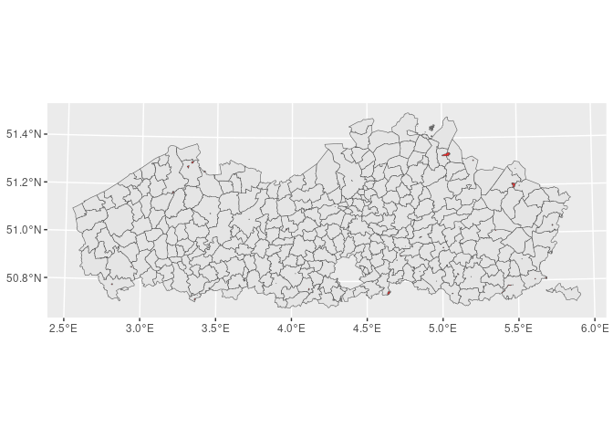

<!-- README.md is generated from README.Rmd. Please edit that file -->

# roeference

<!-- badges: start -->
<!-- badges: end -->

This package provides helper functions to download and load some Flemish
public (geographic) reference datasets such as administrative units, as
well as the public geographic datasets of the Flemish Heritage agency
(agentschap Onroerend Erfgoed).

## Installation

As we’re still working on our first CRAN releas, you can install the
development version of roeference using devtools:

``` r
devtools::install_github('OnroerendErfgoed/roeference')
```

## Example

This package contains several functions for downloading specific
reference datasets:

``` r
library(roeference)

# Get a Simple Features object containging the Flemish municipalities and
# their boundries
municipalities <- get_vrbg_sf()

# Get a Simple Features object containging the Flemish municipalities and
# their boundries
provinces <- get_vrbg_sf(collection = 'Refprv')

# Get a Simple Features object containing the protected archaeological
# sites in Flanders and their boundries
protected_arch_sites <- get_oe_aanduidingsobjecten(layer = 'bes_arch_site')
```

The functions provided in this package will take care of downloading and
extracting the data. They will return a dataframe like object
(DataFrame, Tibble, Simple Features object). which can be directly used
in analysis or plotting.

``` r
library(ggplot2)
library(sf)
#> Linking to GEOS 3.10.2, GDAL 3.4.1, PROJ 8.2.1; sf_use_s2() is TRUE

p <- ggplot(protected_arch_sites) +
       geom_sf(data = municipalities) +
       geom_sf(fill='red', alpha=0.8)
p
```


